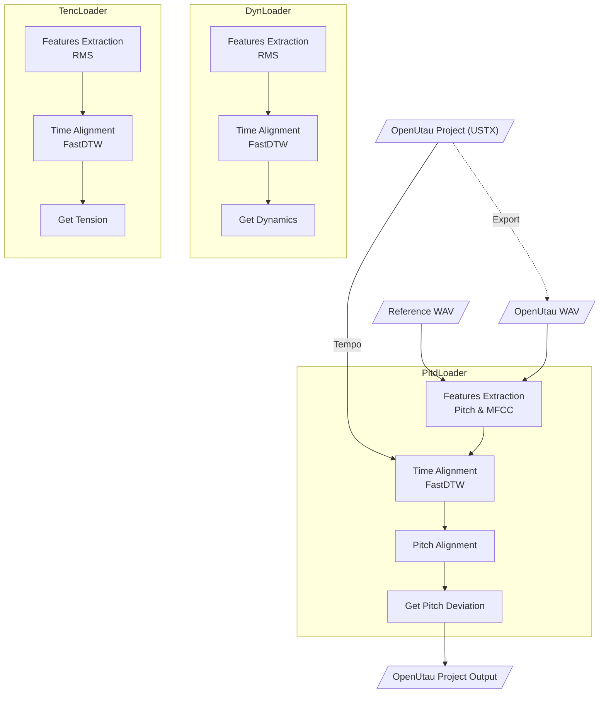

<p align="center">
   
</p>

<p align="center">
  <a href="README.md"></a>
  <a href="README.en.md"></a>
</p>

# Expressive

**Expressive** is a [DiffSinger](https://github.com/openvpi/diffsinger) expression parameter importer developed for [OpenUtau](https://github.com/stakira/OpenUtau). It aims to extract emotional parameters from real human vocals and import them into the appropriate tracks of your project.

The current version supports importing the following expression parameters:

* `Dynamics (curve)`
* `Pitch Deviation (curve)`
* `Tension (curve)`

<p align="center">
   
</p>

> - *OpenUtau version used from [keirokeer/OpenUtau-DiffSinger-Lunai](https://github.com/keirokeer/OpenUtau-DiffSinger-Lunai)*
> - *Singer model from [yousa-ling-official-production/yousa-ling-diffsinger-v1](https://github.com/yousa-ling-official-production/yousa-ling-diffsinger-v1)*

## ✅ Supported Platforms

* Windows / Linux
* OpenUtau Beta (supports DiffSinger)
* Python 3.10 \*

If your system has an NVIDIA GPU driver that supports [CUDA 11.x](https://docs.nvidia.com/deploy/cuda-compatibility/minor-version-compatibility.html) or later (i.e., driver version >= 450), this application will automatically enable GPU acceleration to improve processing speed.

<details>
  <summary>Click to expand platform details</summary>

* \* This project uses [CREPE](https://github.com/marl/crepe) \*\* as the pitch extractor, which depends on TensorFlow. On Windows, TensorFlow 2.10 is the last version that supports GPU acceleration, and Python 3.10 is the highest Python version supported by its `.whl` files.
* \*\* In the future, it may switch to a PyTorch-based alternative like [PESTO](https://github.com/SonyCSLParis/pesto) to improve compatibility.

</details>

## 📌 Use Case

**Typical Need:** When using a DiffSinger virtual singer for covers, users often already have the pitch track with lyrics, but lack suitable emotional expression. This tool is designed to automatically generate and import those expression parameters.

**Required Inputs:**

* Virtual vocal: emotionless synthesized vocal output from OpenUtau (WAV format). It's recommended to keep `Tempo` and segmentation as close to the reference vocal as possible.
* Reference vocal: original human vocal recording (WAV format). You can use tools like [UVR](https://github.com/Anjok07/ultimatevocalremovergui) to remove instrumental and reverb.
* Input project: original OpenUtau project file (`.ustx` format).
* Output project path: where the new processed project will be saved.

**Output:**

* A new `.ustx` file with emotion parameters added. The original project will not be modified.

## ✨ Features

* [x] Windows support
* [x] Linux support
* [x] NVIDIA GPU acceleration
* [x] Parameter config import/export
* [x] `Pitch Deviation` generation
* [x] `Dynamics` generation
* [x] `Tension` generation

## ⚠️ Known Issues

1. The current version does not support tempo changes within a single track. It’s recommended to use a consistent tempo throughout the project. This limitation will be addressed in future updates.

## 🚀 Quick Start

### 1. Clone the repository

> This project uses [Git LFS](https://git-lfs.com/) to store large files such as example audio under `examples/`. Please ensure Git LFS is installed on your system.

```bash
git clone https://github.com/NewComer00/expressive.git --depth 1
cd expressive
```

### 2. Install dependencies

It’s recommended to use a virtual environment:

```bash
pip install -r requirements.txt
```

### 3. Quick Test

If the example audio is available, run the following command to test:

```bash
python ./expressive.py
```

The output project file will be saved to `examples/Прекрасное Далеко/output.ustx`.

## 📖 Usage

### Command Line Interface (CLI)

Display help:

```bash
python ./expressive-cli.py --help
```

Run example in Windows PowerShell:

```powershell
python .\expressive-cli.py `
  --utau_wav "examples/明天会更好/utau.wav" `
  --ref_wav "examples/明天会更好/reference.wav" `
  --ustx_input "examples/明天会更好/project.ustx" `
  --ustx_output "examples/明天会更好/output.ustx" `
  --track_number 1 `
  --expression dyn `
  --expression pitd `
  --pitd.semitone_shift 0 `
  --expression tenc
```

Run example in Linux shell:

```bash
python ./expressive-cli.py \
  --utau_wav "examples/明天会更好/utau.wav" \
  --ref_wav "examples/明天会更好/reference.wav" \
  --ustx_input "examples/明天会更好/project.ustx" \
  --ustx_output "examples/明天会更好/output.ustx" \
  --track_number 1 \
  --expression dyn \
  --expression pitd \
  --pitd.semitone_shift 0 \
  --expression tenc
```

The output project file will be saved to `examples/明天会更好/output.ustx`.

### Graphical User Interface (GUI)

Launch in Chinese:

```bash
python ./expressive-gui.py --lang zh_CN
```

Launch in English:

```bash
python ./expressive-gui.py --lang en
```

## 🔬 Algorithm Workflow


