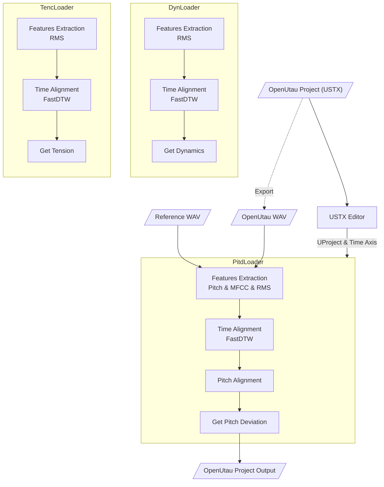

<p align="center">
   
</p>

<p align="center">
  <a href="README.md"></a>
  <a href="README.en.md"></a>
</p>

# Expressive

**Expressive** is a [DiffSinger](https://github.com/openvpi/diffsinger) expression parameter importer developed for [OpenUtau](https://github.com/stakira/OpenUtau). It aims to extract expression parameters from real human vocals and import them into the appropriate tracks of your project.

The current version supports importing the following expression parameters:

* `Dynamics (curve)`
* `Pitch Deviation (curve)`
* `Tension (curve)`

<div align="center">

| **Working with OpenUtau** | **Data Viewer** |
|:---:|:---:|
|  |  |

</div>

> - *OpenUtau version from [keirokeer/OpenUtau-DiffSinger-Lunai](https://github.com/keirokeer/OpenUtau-DiffSinger-Lunai)*
> - *Singer model from [yousa-ling-official-production/yousa-ling-diffsinger-v1](https://github.com/yousa-ling-official-production/yousa-ling-diffsinger-v1)*

> [!TIP]
> <details>
>   <summary><b>👉 Click to expand the full voiced demo video 👈</b></summary>
>
>   <p align="center"><video src="https://github.com/user-attachments/assets/4b5b7c15-947a-4f54-b80e-a14a9eefc86b"></video></p>
>   <p align="center"><video src="https://github.com/user-attachments/assets/4076eb8b-07eb-48e6-bdec-4abeac6258c7"></video></p>
>
> </details>

## ✅ Supported Platforms

* Windows / Linux
* OpenUtau Beta (or other versions with DiffSinger support)
* Python 3.10 \*

By default, this application uses [rmvpe-onnx](https://github.com/newcomer00/rmvpe-onnx) as the pitch extraction backend, which runs on CPU only. [RMVPE](https://arxiv.org/abs/2306.15412v2) is currently the best-performing publicly available pitch extraction algorithm, and its inference speed is fast enough to satisfy the vast majority of use cases.

The [swift-f0](https://github.com/lars76/swift-f0) and [CREPE](https://github.com/marl/crepe) pitch extraction backends are also available. The former runs on CPU only and is the fastest option, though its accuracy is modest. The latter is a classic algorithm in the field and runs more slowly. In a CUDA environment, the CREPE backend will automatically enable GPU acceleration.

> \* On Windows, TensorFlow 2.10 is the last version that supports GPU acceleration, and Python 3.10 is the highest Python version supported by its `.whl` files.

## 📌 Use Case

### Need

When using a DiffSinger virtual singer for covers, users often already have an OpenUtau project with lyrics and pitch track but without expression parameters. This tool extracts expression parameters from a reference vocal and imports them into the OpenUtau project.

### Inputs

> [!TIP]
> Starting from `v0.6.0`, this application supports OpenUtau voice tracks with **multiple parts** and **multiple tempos**.

> [!TIP]
> Starting from `v0.5.0`, users can define a selection region independently within the full audio of both the **Utau vocal** and the **Reference vocal**. The selected audio segment will be used as the final input.

* **Utau vocal**: Emotionless synthesized vocal output from OpenUtau (WAV format). It is recommended to keep the segmentation and tempo as close to the **Reference vocal** as possible, as large discrepancies may affect alignment quality.
* **Reference vocal**: Original human vocal recording (WAV format). You can use tools like [UVR](https://github.com/Anjok07/ultimatevocalremovergui) or [MSST](https://github.com/SUC-DriverOld/MSST-WebUI) to remove instrumentals, harmonies, and reverb.
* **Input project**: Original OpenUtau project file (USTX format).
* **Output path**: Where the new processed project file will be saved.
* **Track number**: The track number in the OpenUtau project where the **Utau vocal** resides (1-based). Expression parameters will be imported into this track.

### Output

A new USTX file with expression parameters added. The original project will not be modified.

## ✨ Features

* [x] Windows support
* [x] Linux support
* [x] NVIDIA GPU acceleration
* [x] Parameter config import/export
* [x] Expression curve visualization
* [x] `Pitch Deviation` generation
* [x] `Dynamics` generation
* [x] `Tension` generation

## 🚀 Direct Install

You can download pre-compiled executable files directly from the [Releases](https://github.com/NewComer00/expressive/releases) page:

### `Expressive-<version>-Windows-x64-CPU.exe`

Expressive CLI / GUI / Viewer installer for Windows x64 architecture.

CPU-only, no CUDA runtime libraries included. Small installation size, but slower when using the CREPE backend for pitch extraction.

### `Expressive-<version>-Windows-x64-GPU.exe`

Expressive CLI / GUI / Viewer installer for Windows x64 architecture with GPU support.

Includes CUDA runtime libraries. When used on a computer with an NVIDIA GPU (driver version >= 450), it significantly improves CREPE backend inference speed.

## 👨‍💻 Install from Source

### Clone the repository

> [!IMPORTANT]
> This project uses [Git LFS](https://git-lfs.com/) to store large files such as example audio under `examples/`. Please ensure Git LFS is installed on your system before cloning.
```bash
git clone https://github.com/NewComer00/expressive.git --depth 1
cd expressive
```

### Install the application

Install the package and its dependencies in a virtual environment:
```bash
pip install -e ".[gpu,gui]"
```

> [!TIP]
> - The `-e` flag installs in editable mode, useful for further development
> - Optional dependency groups available:
>   - `gpu`: GPU acceleration dependencies (e.g., CUDA runtime libraries)
>   - `gui`: Graphical user interface dependencies (e.g., NiceGUI)
>   - `dev`: Development dependencies (e.g., pytest testing framework)
>   - `all`: Install all of the above

After installation, you can use the `expressive` and `expressive-gui` entry points to run the **command-line interface** and **graphical user interface**.

You can also launch a standalone expression curve visualization tool via the `expressive-viewer` command to view and analyze expression curves extracted by `expressive` and `expressive-gui` in real time.

## 📖 Usage

> [!TIP]
> All commands described in this section (as well as the executable files installed via the installer) will automatically adapt to your system language. If you need a different language interface, you can set the [`LANGUAGE` or `LANG` environment variable](https://www.gnu.org/software/gettext/manual/html_node/The-LANGUAGE-variable.html) to override the default.
>
> For example, in Windows PowerShell:
> ```powershell
> $env:LANGUAGE = "en_US"
> expressive-gui
> ```
>
> In Linux shell:
> ```bash
> LANGUAGE="en_US" expressive-gui
> ```

> [!IMPORTANT]
> For users who installed from source, when using the [rmvpe-onnx](https://github.com/newcomer00/rmvpe-onnx) backend, the application will automatically download the model file [rmvpe.onnx (Copyright (c) 2022 lj1995 — MIT License)](https://huggingface.co/lj1995/VoiceConversionWebUI/blob/main/rmvpe.onnx) from Hugging Face.
>
> If you wish to download the model file in advance, you can run the following command after installation:
> ```bash
> rmvpe-onnx download
> ```
>
> If you installed the application via the installer, the model file is already included in the installation package, and no additional download is required.

### Command Line Interface (CLI)

Display help:
```bash
expressive --help
```

Run example in Windows PowerShell:
```powershell
expressive `
  --utau_wav "examples/明天会更好/utau.wav" `
  --ref_wav "examples/明天会更好/reference.wav" `
  --ustx_input "examples/明天会更好/project.ustx" `
  --ustx_output "examples/明天会更好/output.ustx" `
  --track_number 1 `
  --expression dyn `
  --expression pitd `
  --pitd.semitone_shift 0 `
  --expression tenc
```

Run example in Linux shell:
```bash
expressive \
  --utau_wav "examples/明天会更好/utau.wav" \
  --ref_wav "examples/明天会更好/reference.wav" \
  --ustx_input "examples/明天会更好/project.ustx" \
  --ustx_output "examples/明天会更好/output.ustx" \
  --track_number 1 \
  --expression dyn \
  --expression pitd \
  --pitd.semitone_shift 0 \
  --expression tenc
```

The output project file will be saved to `examples/明天会更好/output.ustx`.

### Graphical User Interface (GUI)

Launch GUI:
```bash
expressive-gui
```

> [!IMPORTANT]
> Due to framework limitations, the GUI launched via the `expressive-gui` command currently **does not support drag-and-drop**. To use drag-and-drop, please [install directly](#-direct-install), or run `expressive_gui.py` as a script:
>
> ```bash
> python expressive_gui.py
> ```

### Viewer

Launch the expression curve viewer:
```bash
expressive-viewer
```

You can launch this tool at any time. While it is running, expression curves extracted by `expressive` and `expressive-gui` will be sent to it in real time for visualization.

You can inspect the details of the expression curves in `expressive-viewer`, analyze the extraction results, and adjust parameters as needed to regenerate the curves.

> [!TIP]
> If you want to view multiple expression curves simultaneously, you can launch multiple instances of `expressive-viewer`, and each instance will independently display the received data.

## 📂 Examples

The [`examples/` directory](examples/) contains several sample projects. You can import the `expressive_config.json` file from any example into the GUI to automatically populate all parameters with the preset values.

If you installed the application from the installer, a shortcut named `Expressive Examples` pointing to the examples directory will appear on your desktop after installation — you can import the config files directly from there.

## 🔬 Algorithm Workflow

```mermaid
graph TB;
  ustx_in[/"OpenUtau Project (USTX)"/]
  refwav[/"Reference WAV"/]
  utauwav[/"OpenUtau WAV"/]
  refwav-->feat_pitd
  ustx_in-.->|Export|utauwav
  utauwav-->feat_pitd

  ustx_editor["USTX Editor"]
  ustx_in-->ustx_editor
  ustx_editor-->|UProject & Time Axis|PitdLoader

  subgraph PitdLoader
    direction TB
    feat_pitd["Features Extraction<br>Pitch & MFCC & RMS"]

    time_pitd["Time Alignment<br>FastDTW"]
    feat_pitd-->time_pitd

    pitch_algn["Pitch Alignment"]
    time_pitd-->pitch_algn

    get_pitd["Get Pitch Deviation"]
    pitch_algn-->get_pitd
  end

  utsx_out[/"OpenUtau Project Output"/]
  get_pitd-->utsx_out

  subgraph DynLoader
    direction TB
    feat_dyn["Features Extraction<br>RMS"]

    time_dyn["Time Alignment<br>FastDTW"]
    feat_dyn-->time_dyn

    get_dyn["Get Dynamics"]
    time_dyn-->get_dyn
  end

  subgraph TencLoader
    direction TB
    feat_tenc["Features Extraction<br>RMS"]

    time_tenc["Time Alignment<br>FastDTW"]
    feat_tenc-->time_tenc

    get_tenc["Get Tension"]
    time_tenc-->get_tenc
  end
```

## ⚠️ Troubleshooting

### Drag-and-drop does not work on first launch after installation

#### Symptom
On Windows 10 / 11, after installing the application from the installer for the **first time** (reinstalling after a previous uninstall does not count), the drag-and-drop functionality does not work.

#### Possible Cause
The [NiceGUI](https://nicegui.io/) framework's support for drag-and-drop in native applications is not yet fully mature. The drag-and-drop feature in this application is currently implemented via the underlying library [pywebview](https://pywebview.flowrl.com/).

#### Solution
Relaunching the application should restore normal functionality, and this issue will not occur again on the same system afterward.

#### Future Plan
The NiceGUI framework has begun improving its drag-and-drop support and should resolve this in a future release.

### PITD expression curve is overall too flat

#### Symptom
The extracted PITD expression curve is too flat, with almost no significant variation overall. Pitch changes in the reference vocal are not reflected in the expression curve.

#### Possible Cause
The two confidence thresholds in the PITD extractor are set **too high**, causing many pitch changes to be discarded.

#### Solution
First try using the best-performing rmvpe-onnx backend (with default confidence thresholds). If the issue persists, try lowering both confidence thresholds. In general, the **Utau vocal** is relatively clean, so it is advisable to first adjust the confidence threshold for the **Reference vocal**.

### PITD expression curve has sudden jumps or spikes at certain positions

#### Symptom
The PITD expression curve changes too rapidly at certain positions, with very large jumps or spikes that clearly do not match natural vocal behavior.

#### Possible Cause
The two confidence thresholds in the PITD extractor are set **too low**, causing erroneous detection results to be accepted.

#### Solution
First try using the best-performing rmvpe-onnx backend (with default confidence thresholds). If the issue persists, try increasing both confidence thresholds. In general, the **Utau vocal** is relatively clean, so it is advisable to first adjust the confidence threshold for the **Reference vocal**.
