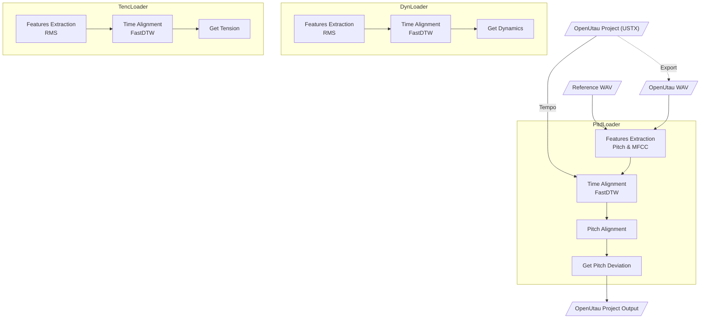

<p align="center">
   
</p>

<p align="center">
  <a href="README.md"></a>
  <a href="README.en.md"></a>
</p>

# Expressive

**Expressive** 是一个为 [OpenUtau](https://github.com/stakira/OpenUtau) 开发的 [DiffSinger](https://github.com/openvpi/diffsinger) 表情参数导入工具，旨在从真实人声中提取情感参数，并导入至工程的相应轨道。

当前版本支持以下表情参数的导入：

* `Dynamics (curve)`
* `Pitch Deviation (curve)`
* `Tension (curve)`

<p align="center">
   
</p>

> *OpenUtau 版本来自 [keirokeer/OpenUtau-DiffSinger-Lunai](https://github.com/keirokeer/OpenUtau-DiffSinger-Lunai)*
> *歌手模型来自 [yousa-ling-official-production/yousa-ling-diffsinger-v1](https://github.com/yousa-ling-official-production/yousa-ling-diffsinger-v1)*

## ✅ 支持平台

* Windows / Linux
* OpenUtau Beta（支持 DiffSinger）
* Python 3.10 \*

支持使用 NVIDIA GPU 进行计算加速，需安装支持 [CUDA 11.x](https://docs.nvidia.com/deploy/cuda-compatibility/) 的显卡驱动。

<details>
  <summary>点击展开更多平台说明</summary>

* \* 本项目使用 [CREPE](https://github.com/marl/crepe) 作为音高提取器，依赖于 TensorFlow 框架。

  * 在 Windows 下，最后支持 GPU 加速的 TensorFlow 版本为 2.10，且 [PyPI](https://pypi.org/project/tensorflow/2.10.1/#files) 提供的 `.whl` 文件版本有限。
* \*\* 未来可能切换至基于 PyTorch 的 [PESTO](https://github.com/SonyCSLParis/pesto) 替代 CREPE，以提高兼容性。

</details>

## 📌 使用场景

**典型需求**：在使用 DiffSinger 虚拟歌手翻唱时，用户通常已完成填词的音高轨，但缺少合适的情感表现。本工具正是为自动生成并导入这些表情参数而设计。

**所需输入：**

* 歌姬音声：由 OpenUtau 输出的无表情虚拟歌声音频（WAV 格式）。建议节奏 (`Tempo`) 和分段尽量与参考人声一致。
* 参考人声：原始人声录音（WAV 格式），可使用 [UVR](https://github.com/Anjok07/ultimatevocalremovergui) 等工具去除伴奏与混响。
* 输入工程：原始 OpenUtau 工程文件（USTX 格式）。
* 输出工程路径：处理完成后新工程文件的保存位置。

**输出结果：**

* 一个携带情感参数的新 USTX 文件，原始工程不会被修改。

## ✨ 功能特性

* [x] Windows 支持
* [x] Linux 支持
* [x] NVIDIA GPU 加速
* [x] 参数配置导入 / 导出
* [x] `Pitch Deviation` 参数生成
* [x] `Dynamics` 参数生成
* [x] `Tension` 参数生成

## ⚠️ 已知问题

1. 当前版本尚不支持单一轨道中的 `Tempo` 变化，建议工程全程使用统一节奏。该限制将在未来版本中解决。

## 🚀 快速开始

### 1. 克隆项目

> 本项目使用 [Git LFS](https://git-lfs.com/) 存储 `examples/` 下的示例音频等大文件。请确保本地已正确安装 Git LFS。

```bash
git clone https://github.com/NewComer00/expressive.git --depth 1
cd expressive
```

### 2. 安装依赖

建议在虚拟环境中操作：

```bash
pip install -r requirements.txt
```

### 3. 快速测试

若示例音频存在，可运行以下命令测试：

```bash
python ./expressive.py
```

输出工程文件将保存在 `examples/Прекрасное Далеко/output.ustx`。

## 📖 使用方式

### 命令行界面（CLI）

显示帮助信息

```bash
python ./expressive-cli.py --help
```

在 Windows PowerShell 中执行示例命令

```powershell
python .\expressive-cli.py `
  --utau_wav "examples/明天会更好/utau.wav" `
  --ref_wav "examples/明天会更好/reference.wav" `
  --ustx_input "examples/明天会更好/project.ustx" `
  --ustx_output "examples/明天会更好/output.ustx" `
  --track_number 1 `
  --expression dyn `
  --expression pitd `
  --pitd.semitone_shift 0 `
  --expression tenc
```

在 Linux Shell 中执行示例命令

```bash
python ./expressive-cli.py \
  --utau_wav "examples/明天会更好/utau.wav" \
  --ref_wav "examples/明天会更好/reference.wav" \
  --ustx_input "examples/明天会更好/project.ustx" \
  --ustx_output "examples/明天会更好/output.ustx" \
  --track_number 1 \
  --expression dyn \
  --expression pitd \
  --pitd.semitone_shift 0 \
  --expression tenc
```

### 图形用户界面（GUI）

启动中文界面

```bash
python ./expressive-gui.py --lang zh_CN
```

Launch with English UI

```bash
python ./expressive-gui.py --lang en
```

## 🔬 算法流程

