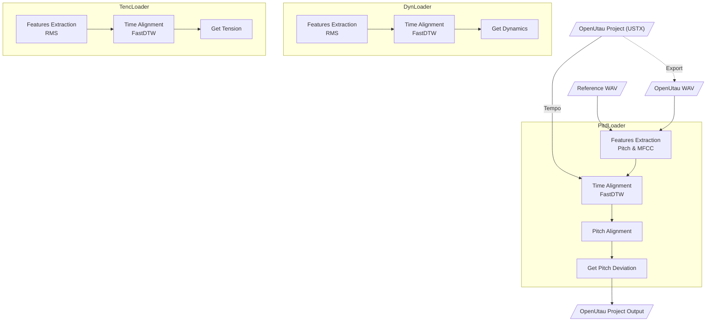

<p align="middle">
   
</p>

# Expressive

针对 [OpenUtau](https://github.com/stakira/OpenUtau) 开发的 [DiffSinger](https://github.com/openvpi/diffsinger) 表情参数导入工具，用于从现实歌手的人声中提取表情，并导入到工程的相应轨道上。

当前版本支持`Dynamics (curve)`、`Pitch Deviation (curve)`与`Tension (curve)`表情参数导入。


<p align="middle">
   
</p>

OpenUtau from [keirokeer/OpenUtau-DiffSinger-Lunai](https://github.com/keirokeer/OpenUtau-DiffSinger-Lunai)  
Singer from [yousa-ling-official-production/yousa-ling-diffsinger-v1](https://github.com/yousa-ling-official-production/yousa-ling-diffsinger-v1)

## 适用平台
- Windows / Linux
- OpenUtau Beta（带有 DiffSinger 支持）
- Python == 3.10 *

建议使用带有NVIDIA显卡的硬件平台，显卡驱动版本 >= 452.39

<details>
  <summary>点击查看更多信息</summary>

\* 音高提取器[CREPE](https://github.com/marl/crepe)依赖于TensorFlow框架**。而在Windows平台下，最后一个支持GPU加速的TensorFlow版本为2.10，且[PyPI](https://pypi.org/project/tensorflow/2.10.1/#files)只提供有限版本的`whl`支持

\** 未来考虑使用基于Pytorch的[PESTO](https://github.com/SonyCSLParis/pesto)代替CREPE

</details>

## 使用场景
- 目标：在 OpenUtau 中使用 DiffSinger 虚拟歌手翻唱歌曲时，已经做完带填词的无参轨道，现需要为其添加不同表情参数。该应用为解决此需求而生。

- 输入：用户需要为该应用提供
    - 歌姬音声：OpenUtau 输出的虚拟歌手无参音声。曲速（`Tempo`）、分段尽量同参考人声相似。WAV 格式。
    - 参考人声：参考歌手的纯人声。可通过 [UVR](https://github.com/Anjok07/ultimatevocalremovergui) 等工具去除伴奏和[混响](https://github.com/Anjok07/ultimatevocalremovergui/issues/469#issuecomment-1507664943)。WAV 格式。
    - 输入工程：对应的 OpenUtau 工程文件。USTX 格式。
    - 输出工程：处理后的 OpenUtau 工程文件的输出位置。

- 输出：在指定位置生成的一个新工程文件，其携带表情参数。本应用不会修改原始工程。

## 支持特性
- [x] Windows 适配
- [x] Linux 适配
- [x] NVIDIA GPU 加速
- [x] 导入 / 导出参数配置
- [x] `Pitch Deviation (curve)`表情参数生成
- [x] `Dynamics (curve)`表情参数生成
- [x] `Tension (curve)`表情参数生成

## 已知问题
1. 目前尚不支持单轨道内`Tempo`的变化，全工程请使用同一个`Tempo`。未来版本将做出修复。

## 部署步骤
- **注意 1**：本项目仓库使用[Git LFS](https://git-lfs.com/)技术来存放`examples/`目录下的示例音频文件。在克隆项目前，请确保已安装相关支持，否则将无法访问这些文件。

- **注意 2**：此项目的Python依赖包数量较多，本地部署时建议使用虚拟环境。

克隆本仓库的最新内容
```sh
git clone https://github.com/NewComer00/expressive.git --depth 1
```

进入仓库所在目录
```sh
cd expressive
```

在当前Python环境中下载并安装依赖包
```sh
pip install -r ./requirements.txt
```

若`examples/`目录下的示例文件存在，可尝试运行测试。运行结束后，`examples/Прекрасное Далеко/`目录中会出现一个表情参数生成完毕的OpenUtau工程文件`output.ustx`
```sh
python ./expressive.py
```

运行命令行用户交互界面（CLI）
```sh
# show help
python ./expressive-cli.py --help

# exmaple
python ./expressive-cli.py --utau_wav "examples/明天会更好/utau.wav" --ref_wav "examples/明天会更好/reference.wav" --ustx_input "examples/明天会更好/project.ustx" --ustx_output "examples/明天会更好/output.ustx" --track_number 1 --expression dyn --expression pitd --pitd.semitone_shift 0 --expression tenc
```

运行图形化用户界面（GUI）
```sh
# 中文界面
python ./expressive-gui.py --lang zh_CN

# English UI
python ./expressive-gui.py --lang en
```

## 算法原理

