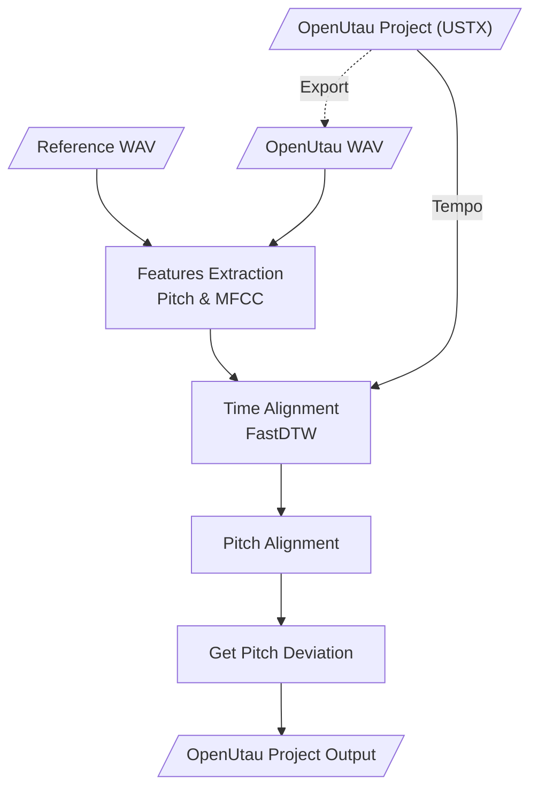

# OpenUtau Pitchloader

针对OpenUtau开发的表情参数导入工具，用于从现实歌手的人声中提取表情，并导入到工程的相应轨道上。

当前版本仅支持`Pitch Deviation`表情参数导入，故本应用的暂用名为“Pitchloader”。


<p align="middle">
  
   
</p>

OpenUtau from [keirokeer/OpenUtau-DiffSinger-Lunai](https://github.com/keirokeer/OpenUtau-DiffSinger-Lunai)  
Singer from [yousa-ling-official-production/yousa-ling-diffsinger-v1](https://github.com/yousa-ling-official-production/yousa-ling-diffsinger-v1)

## 适用平台
- Windows / Linux
- OpenUtau
- Python 3.8 - 3.10 *

建议使用带有NVIDIA显卡的硬件平台，显卡驱动版本 >= 452.39

<details>
  <summary>点击查看更多信息</summary>

\* 音高提取器[CREPE](https://github.com/marl/crepe)依赖于TensorFlow框架**。而在Windows平台下，最后一个支持GPU加速的TensorFlow版本为2.10，且[PyPI](https://pypi.org/project/tensorflow/2.10.1/#files)只提供有限版本的`whl`支持

\** 未来考虑使用基于Pytorch的[PESTO](https://github.com/SonyCSLParis/pesto)代替CREPE

</details>

## 使用场景
- 目标：在OpenUtau中使用虚拟歌手翻唱歌曲时，已经做好无参轨道，现需要为其添加`Pitch Deviation`表情参数。该应用为解决此需求而生。

- 输入：用户需要为该应用提供
    - 参考人声：参考歌手的纯人声。可通过[UVR](https://github.com/Anjok07/ultimatevocalremovergui)等工具去除伴奏和[混响](https://github.com/Anjok07/ultimatevocalremovergui/issues/469#issuecomment-1507664943)。WAV格式。
    - 歌姬音声：OpenUtau输出的虚拟歌手无参音声。曲速（`Tempo`）、分段尽量同参考人声相似。WAV格式。
    - 工程文件：对应的OpenUtau无参工程文件。USTX格式。

- 输出：原始工程文件旁将生成一个新的工程文件，其载入了`Pitch Deviation`表情信息。本应用不会修改原始工程。

## 支持特性
### 功能
- [x] `Pitch Deviation`表情参数生成
- [ ] `Dynamics`表情参数生成
- [ ] `Tension`表情参数生成

### 交互
- [x] 自带使用方法说明
- [x] 单击或悬停于参数输入框时，弹出参数说明
- [x] 自动保存用户上一次输入的参数
- [x] 音高数据可视化

### 平台
- [x] NVIDIA GPU 加速
- [x] Windows 适配
- [x] Linux 适配

## 已知问题
1. 目前尚不支持单轨道内`Tempo`的变化，全工程请使用同一个`Tempo`。未来版本将做出修复。

## 算法原理


## 部署步骤
- **注意 1**：本项目仓库使用[Git LFS](https://git-lfs.com/)技术来存放`examples/`目录下的示例音频文件。在克隆项目前，请确保已安装相关支持，否则将无法访问这些文件。

- **注意 2**：此项目的Python依赖包数量较多，本地部署时建议使用虚拟环境。

克隆本仓库`pitchloader`分支的最新内容
```sh
git clone -b pitchloader --single-branch https://github.com/NewComer00/openutau-pitchloader.git
```

进入仓库所在目录
```sh
cd openutau-pitchloader
```

在当前Python环境中下载并安装依赖包
```sh
pip install -r ./requirements.txt
```

若`examples/`目录下的示例文件存在，可尝试运行测试。运行结束后，`examples/Прекрасное Далеко/`目录中会出现一个表情参数生成完毕的OpenUtau工程文件`test-output.ustx`
```sh
python ./pitchloader.py
```

运行图形用户交互界面（GUI）
```sh
python ./pitchloader-gui.py
```

如需使用英文界面
```sh
# If an English GUI is needed
python ./pitchloader-gui.py --lang en
```
